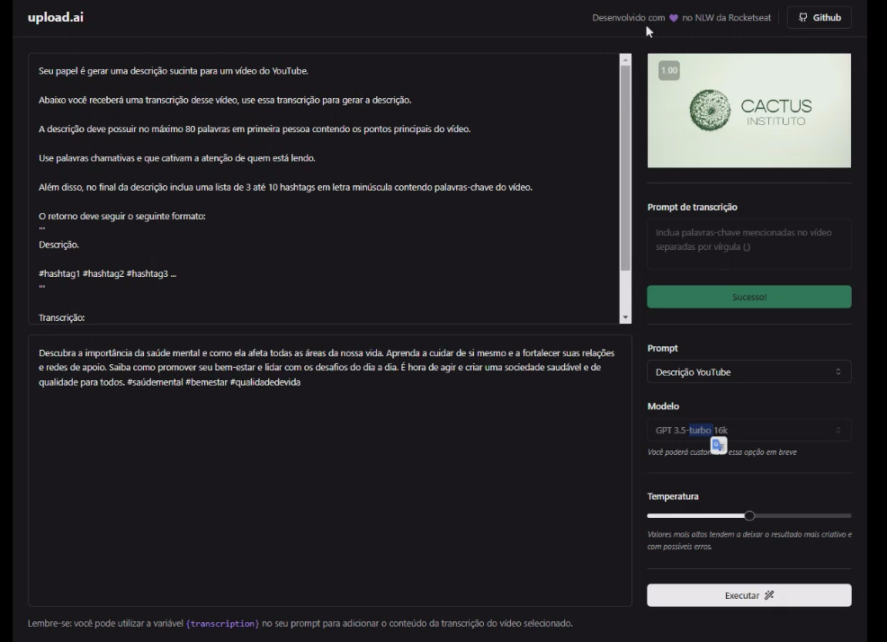

# upload.ai - NLW IA

###  🚀 Trilha Mastery


<p align="center">
  
</p>
<br/>


> ##  Front-end


###  🚀 Projeto desenvolvido no evento NLW da Rocketseat

Aplicação que possibilita realizar upload de videos e por meio de IA, criar automaticamente títulos chamativos e descrições com um boa indexação.


<br/>

  


## 🚀 Tecnologias

Este projeto foi desenvolvido com as seguintes tecnologias:

- Vite
- React
- Typescript
- Tailwind CSS
- PostCSS
- Autoprefixer
- ESlint
- Radix UI
- Shadcn/ui
- Lucide-react
- FFmpeg

<br/>

## 🚀 Executando o projeto

Antes de iniciar, certifique-se de ter o `Node.js` e o `npm` instalados em seu computador e após siga os seguintes passos:

1. Clone o repositório:

```
$ git clone https://github.com/Gisellebm/nlw-upload-ai.git
```

2. Acesse a pasta do projeto:

```
$ cd upload-ai-web
```

3. Instale as dependências:

```
$ npm install
```

4. Inicie o servidor:

```
$ npm run dev
```


<br/>

## Contato: gisellemacedo.dev@gmail.com

<a href="https://www.linkedin.com/in/giselle-brasil-macedo-729113137/" target="_blank"></a>
<br/>


<h3 align="center">Feito com 💜 by Giselle</h3>

